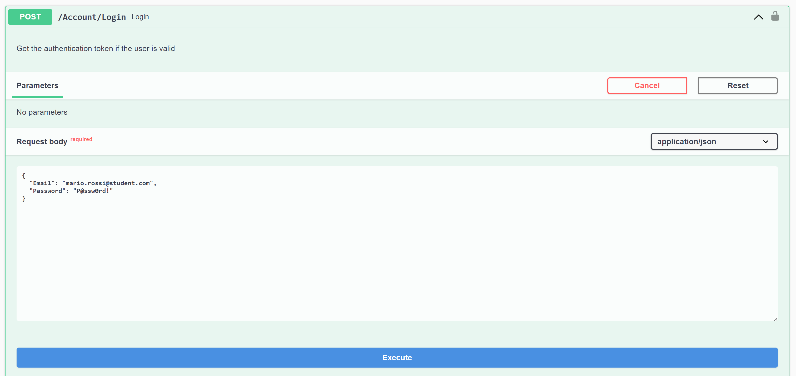
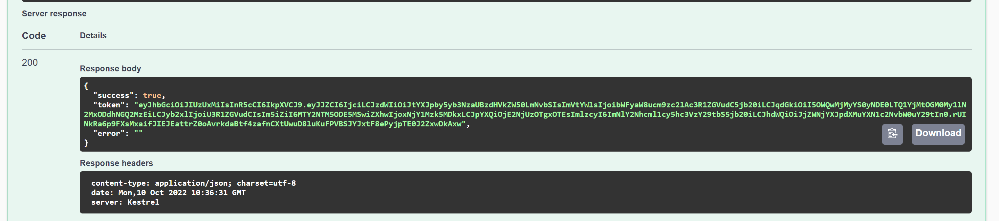
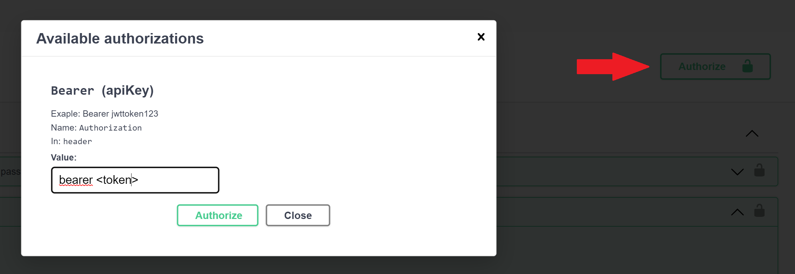
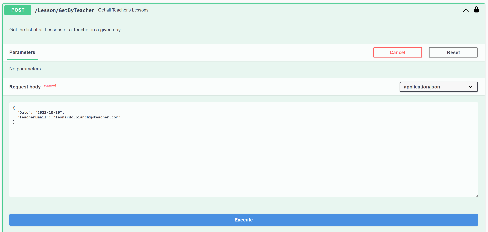
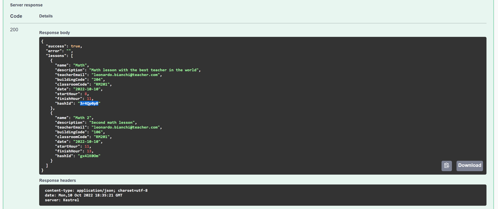
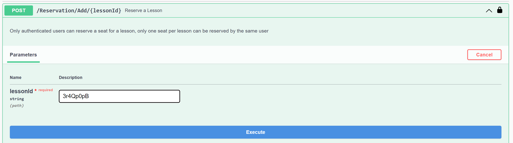

# ValerioProdigit
Simple web api project inspired by the reservation system of my university.

During the Covid-19 pandemic Sapienza University of Rome has decided to implement a reservation system for the classrooms.
The system is based on a web application that allows students to reserve a classroom for a specific time slot. 

Unfortunately this system is not very user friendly and has some bugs;
so the goal for my project is to create a simple but complete web api that offers the same type of services as the official one with some improvements.

Major improvements:
- No conflicts between reservations (the original system gives the same seat to two different students if they reserve at the same time);
- The possibility to reserve a specific Lesson (the original system allows only to reserve a specific time slot, indipendently from the lessons);
- Interactive api documentation using [Swagger](https://swagger.io/).

## Example
The following example shows how to reserve a seat for a specific lesson.
1) login as a student with a registered account to get the authentication json web token:
   
2) copy the token form the OK response:
   
3) paste the token in the "Authorize" field of the swagger documentation (in the top right corner):
   
   replace "\<token>" with the token you copied in step 2; this action will allow you to make authenticated requests by put the token in the "Authorization" header of the request.
   (ATTENTION: the token expires after few minutes as configured in the appsettings.json file)
4) retrieve the list of the available lessons of a specific teacher for a specific day:
   
5) copy the id of the lesson you want to reserve:
   
6) reserve the seat for the lesson you selected:
   

## How to run
### Minimum requirements
1) Download and install the .NET SDK version 6 or higher
    ```
    https://dotnet.microsoft.com/en-us/download
    ```
2) Open a terminal and clone the project using
    ```
    git clone https://github.com/ValerioCeccarelli/ValerioProdigit.git
    ```
3) Browse the main project directory
    ```
    cd ValerioProdigit/ValerioProdigit.Api/
    ```
4) Complete the configuration with your personal data:
   (go to appsettings.json and change the following settings)
   - Jwt key token (REQUIRED): add an alphanumeric string of 32 chars ```Settings -> JwtSettings -> Secret```
   - HashId salt (REQUIRED): add an alphanumeric string ```Settings -> HashidSettings -> Salt```

5) Configure the SendGrid email services (in appsettings.json):
   - Create a free account on SendGrid: [link](https://signup.sendgrid.com/);
   - Create an API key: [link](https://app.sendgrid.com/settings/api_keys);
   - Add the API key to the appsettings.json file ```Settings -> SendGridSettings -> ApiKey```;
   - Add the email address of the sender ```Settings -> SendGridSettings -> SenderEmail```;

6) Install the dotnet Entity Framework tools
    ```
    dotnet tool install --global dotnet-ef
    ```
7) Create the first migration
    ```
    dotnet ef migrations add "Init"
    ```
8) Update the database
    ```
    dotnet ef database update
    ```
9) Restore dependencies
    ```
    dotnet restore
    ```
10) Run the project
    ```
    dotnet run
    ```
### Optional settings

1) Configure the Swagger UI (in appsettings.json):
   ```json
   "Swagger": {
    "Contact": {
      "Name": "<contact name>",
      "Email": "<contact email>",
      "Url": "<contact url>"
    },
    "License": {
      "Name": "<license name>",
      "Url": "<license url>"
    },
    "Info": {
      "Version": "V1",
      "Title": "Api for ValerioProdigit",
      "Description": "<description>",
    }
   }
   ```
    